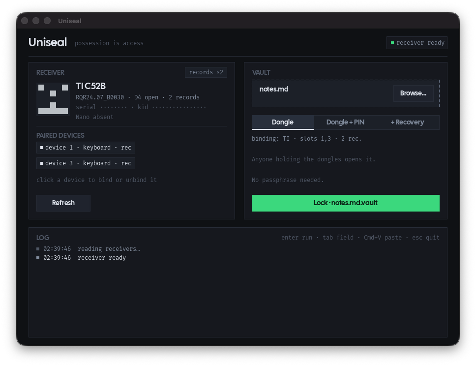

# Uniseal — file vault bound to a Logitech Unifying receiver

Old Logitech Unifying receivers pile up in drawers once their mouse or
keyboard is gone. Uniseal gives them a second life as the key of a small
file vault: possession of the receiver(s) is the default access, a PIN or a
recovery passphrase can be added on top, LUKS-style. A receiver with no
device paired still works (bound to its serial, which is weak on its own,
so add a PIN); one with old pairing records still in flash gives the
strongest binding. Files of any size stream through in 1 MiB chunks.



```sh
uniseal id                          # live fingerprint, grade, key id
uniseal lock secret.txt             # -> secret.txt.vault (dongle keyslot)
uniseal lock secret.txt --pin       # dongles AND a PIN (real second factor)
uniseal lock secret.txt --recovery  # + passphrase-only keyslot (no dongles)
uniseal lock secret.txt --bind 1,3  # bind to receiver slots 1 and 3 only
uniseal lock secret.txt --bind receiver  # receiver serial(s) alone, no device
uniseal unlock secret.txt.vault     # -> secret.txt (or .open if it exists)
uniseal info secret.txt.vault       # keyslots, and which ones open right now
uniseal addkey secret.txt.vault --recovery    # add a keyslot to a vault
uniseal delkey secret.txt.vault 1             # remove one (never the last)
uniseal gui [file]                  # SDL2 window: drop a file, pick a mode, Lock/Unlock
```

## How it works

Every vault has a random 256-bit file key. The data is encrypted once
with XChaCha20-Poly1305 under that key; keyslots wrap the key under
different credentials, so any slot opens the vault and slots can be added
or removed without touching the data:

- **dongle**: possession only. KEK = HKDF-SHA256(fingerprint material).
- **dongle + PIN**: KEK = HKDF-SHA256(Argon2id(PIN) ‖ material). Whoever
  steals the dongle still needs the PIN; whoever knows the PIN still needs
  the dongle.
- **passphrase**: Argon2id (64 MiB, t=3) only. A recovery slot for the
  day a mouse is re-paired or the firmware gets updated.

Each slot carries a public key id (a separate HKDF tag of the material),
so `info` and `unlock` say *why* a slot is not openable ("needs dongle
TI+Nano, plugged TI") instead of a bare refusal. Only RustCrypto crates,
secrets are `zeroize`d, outputs are written atomically with mode 0600 and
never overwrite an existing file. `lock` re-opens the vault it just wrote
before reporting success.

Format (`UNISEAL1`): magic, slot count, 112-byte slots (kind, dongle mask,
record count, bind mask, kid, salt, Argon2 params, nonce, wrapped key +
tag), then a 19-byte nonce prefix and the body in 1 MiB chunks, each an
XChaCha20-Poly1305 message whose nonce carries the chunk counter and a
last-chunk flag (STREAM): reordering and truncation are detected, and a
file of any size streams through in constant memory. A known-answer test
pins the bytes.

## The fingerprint

`uniseal-fp-v1` binds, length-prefixed: receiver serial(s), and for each
*bound* receiver slot the device WPID, serial and 16-byte *pairing record*
when the firmware still exposes the D4 register, plus the Nano CU-0010
serial when one is plugged. Any combination works: TI only, Nano only, or
both. The firmware version is deliberately excluded.

The bind mask is stored in the keyslot. By default a vault binds every
slot occupied at lock time; `--bind 1,3` or `--bind receiver` narrows it,
and the GUI lets you click devices in and out. Pairing a new device in a
free slot never changes an existing binding; unpairing a bound device
does, and `info` says which slot went missing.

Two rules keep a bus glitch from silently changing the key: a timeout on
any register aborts the read (nothing is guessed or skipped), and the
material must come back identical on two consecutive reads.

Grades, shown honestly:

| grade | fresh secret material | order of magnitude |
|---|---|---|
| `serials only` | receiver serial + device serial | ~64 bits |
| `pairing records (N)` | + two 4-byte nonces per device | +64 bits per device |

The pairing record is *not* the AES link key: it is the material the key
is derived from (receiver serial, device WPID, receiver WPID `8808`, two
nonces). Serials may not be uniform, and all of it went over the air in
clear at least once: the receiver address is broadcast, the nonces are
exchanged at pairing time (see CVE-2019-13052). Add a PIN if that
bothers you; the Argon2id slot is what stands between a stolen vault and a
brute force of the serials.

## Requirements

- A Logitech Unifying receiver: CU-0008 (USB id C52B, "TI") and/or
  CU-0010 (C52F, "Nano"). Any unit works; pairing records need a firmware
  that still answers the D4 register (older RQR24 / RQR12 builds), so do
  not let Logitech software update it.
- macOS with Homebrew: `brew install sdl2 sdl2_ttf pkg-config`
- Rust stable. `cargo build`, `cargo test`, `UNISEAL_SMOKE=1 uniseal gui`
  (auto-quits, for smoke tests). `UNISEAL_PRIVATE=1` masks serials, key
  ids and device names in the window, for screenshots.

The window shows the plugged receivers (identicon and key id, grade,
paired devices), a drop zone for the file, the keyslot policy for locking
(Dongle / Dongle + PIN / + Recovery) and, for a `.vault`, its keyslots with
whether each one opens right now. Enter runs the primary action, Tab
switches fields, Cmd+V pastes a path.

Fonts bundled in the binary (SIL OFL, licenses in `assets/fonts`): Cal Sans
for titles and buttons, Fira Code for everything else.

## Threat model (read this)

Anyone holding your dongle(s), even briefly, can read the same registers
and derive the same material: HID has no authentication and the secret
leaves the dongle on every use. Malware running while a dongle is plugged
in can too. A dongle-only slot protects files against remote file theft,
not against dongle theft; a dongle + PIN slot protects against either one
alone. Unpairing a bound device changes the fingerprint: keep a recovery
slot. The Nano's writable "rfs" scratch byte (HID++ register 0x03) was
measured to reset on every power cycle, so it is deliberately not part of
the key: there is no re-key without re-locking.
A toy with real crypto, not an HSM.

## License

Copyright (C) 2026 Synthe.se. Uniseal is free software under the GNU
General Public License v3.0 or later (see `LICENSE`): keep the notices,
and any derivative ships its source under the same terms. Bundled fonts
keep their own SIL Open Font License (`assets/fonts`).
